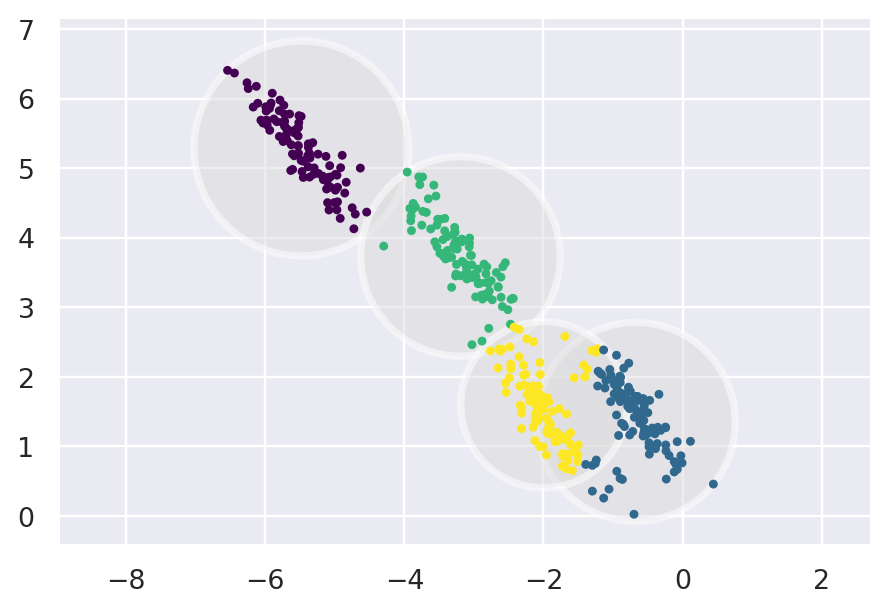

### Stuff this article aims to cover

* **GMM** vs **KMeans**
* The **EM Algorithm** in the context of **GMM**


# Introduction

The **GMM** algorithm is a **clustering** algorithm. It can be viewed as an extension of the ideas behind **KMeans** (another clustering algorithm). It is also a tool that can be used for tasks other than simple clustering.

# GMM vs KMeans

Before diving deeper into the differences between these 2 clustering algorithms, let's generate some sample data and plot it.

```py
import matplotlib.pyplot as plt
import seaborn as sns; sns.set()
import numpy as np
from sklearn.datasets import make_blobs
from sklearn.cluster import KMeans

X, y_true = make_blobs(
    n_samples=500, centers=5,
    cluster_std=0.9, random_state=17
)

kmeans= KMeans(5, random_state=420)
labels = kmeans.fit(X).predict(X)
plt.figure(dpi=175)
plt.scatter(X[ : , 0], X[ : , 1], c=labels, s=7, cmap='viridis')
```


We generated our sample data and we applied the **KMeans** algorithm. After looking at the way each point has been assigned to its cluster we notice that it seems to be a slight overlap between the 2 top right clusters. And this observation leads us to expect that the clustering assignments for some points is more certain than clustering assignments to over points. Well, **KMeans** has no measure of probability or uncertainty for clustering assignments (and if you probably guessed it **GMM** does).

We can visualize the way **KMeans** assigns clusters by placing a circle (in higher dimensions, a hyper-sphere) at the center of each cluster, with a radius defined by the most distant point in the cluster. In the training set, every point outside the circle is not considered a member of the cluster. 

```py
from scipy.spatial.distance import cdist

def plot_kmeans(kmeans, X, ax=None):
    labels = kmeans.fit_predict(X)

    # plot the input data
    plt.figure(dpi=175)
    ax = ax or plt.gca()
    ax.axis('equal')
    ax.scatter(X[:, 0], X[:, 1], c=labels, s=7, cmap='viridis', zorder=2)

    # plot the representation of the k-means model
    centers = kmeans.cluster_centers_
    radii = [
        cdist(X[labels == i], [center]).max()
        for i, center in enumerate(centers)
    ]
    for c, r in zip(centers, radii):
        ax.add_patch(plt.Circle(
            c, r, fc='#DDDDDD', lw=3, alpha=0.5, zorder=1
        ))


kmeans = KMeans(n_clusters=5, random_state=420)
plot_kmeans(kmeans, X)
```


Another observation that has to be made is that these cluster models are always circular. **KMeans** has no builtin way to deal with clusters that have oblong or elliptical shapes. 

In short, these are the 2 main disadvantages of **KMeans**:
* lack of flexibility in cluster shape
* lack of probabilistic cluster assignment

# The EM Algorithm in the context of GMM

A **Gaussian mixture model (GMM)** attempts to find a mixture of multidimensional Gaussian probability distributions that best model any input dataset. In the simplest case, **GMM**s can be used for finding clusters in the same manner as **KMeans** does. 

```py
from sklearn.mixture import GaussianMixture

gmm = GaussianMixture(n_components=5).fit(X)
labels = gmm.predict(X)
plt.figure(dpi=175)
plt.scatter(X[ : , 0], X[ : , 1], c=labels, s=7, cmap='viridis')
```


But because **GMM** contains a probabilistic model under the hood, it is also possible to find the probability that any point in the given dataset belongs to any given cluster.

```py
probabilities = gmm.predict_proba(X)
probabilities
```

The **probabilities** variable is a **numpy array**, it has a shape of **number of samples** x **number of clusters**. Each row corresponds to a single data point and the **j**th column corresponds to the probability that the sample belongs to the **j**th cluster.

Under the hood, the **GMM** algorithm has something in common with **KMeans**. They both use the expectation–maximization approach that qualitatively does the following:

1. Choose starting guesses for the location and shape
2. Repeat until converged
    <ol type='a'>
        <li>
            <i>E-Step</i>: for each point, find weights encoding the probability of membership in each cluster
        </li>
        <li>
            <i>M-Step</i>: for each cluster, update its location, normalization, and shape based on all data points, making use of the weights
        </li>
    </ol>

In the result of this approach, each cluster is associated with a smooth Gaussian Model (not with a hard-edged sphere as in **KMeans**). Also in practice this algorithm uses multiple random initializations because just like **KMeans** it might miss the globally optimal solution.

The following function will help us visualize the locations and shapes of the **GMM** clusters.

```py
from matplotlib.patches import Ellipse

def plot_gmm(gmm, X, label=True, ax=None):
    def draw_ellipse(position, covariance, ax=None, **kwargs):
        ax = ax or plt.gca()

        if covariance.shape == (2, 2):
            U, s, Vt = np.linalg.svd(covariance)
            angle = np.degrees(np.arctan2(U[1, 0], U[0, 0]))
            width, height = 2 * np.sqrt(s)
        else:
            angle = 0
            width, height = 2 * np.sqrt(covariance)

        for nsig in range(1, 4):
            ax.add_patch(Ellipse(
                position, nsig * width, nsig * height,
                angle, **kwargs
            ))
    
    ax = ax or plt.gca()
    labels = gmm.fit(X).predict(X)
    if label:
        ax.scatter(X[:, 0], X[:, 1], c=labels, s=7, cmap='viridis', zorder=2) 
    else:
        ax.scatter(X[:, 0], X[:, 1], s=7, zorder=2)
    
    ax.axis('equal')
    w_factor = 0.2 / gmm.weights_.max()
    for pos, covar, w in zip(gmm.means_, gmm.covariances_, gmm.weights_):
        draw_ellipse(pos, covar, alpha=w * w_factor)
```

Now let's use the function to see how the clusters are shaped now on our data.

```py
gmm = GaussianMixture(n_components=5, random_state=420)
plt.figure(dpi=175)
plot_gmm(gmm, X)
```


In order, to make this advantage of **GMM** a little more obvious we will create a new sample dataset that has a different shape.

```py
X, y_true = make_blobs(n_samples=400, centers=4, cluster_std=0.60, random_state=0)
X = X[:, ::-1] # flip axes for better plotting

rng = np.random.RandomState(13)
X_stretched = np.dot(X, rng.randn(2, 2))
```

Now let's apply both algorithms and see what the resulting clusters look like.

```py
kmeans = KMeans(n_clusters=4, random_state=0)
plot_kmeans(kmeans, X_stretched)
```



```py
gmm = GaussianMixture(n_components=4, covariance_type='full', random_state=42)
plt.figure(dpi=175)
plot_gmm(gmm, X_stretched)
```


These results make it clear that **GMM** has a lot more flexibility in cluster shape.

Also, note that for the previous fit the hyperparameter **covariance_type** was set differently. This hyperparameter controls the degrees of freedom in the shape of each cluster. 
* The default is **covariance_type="diag"**, which means that the size of the cluster along each dimension can be set independently, with the resulting ellipse constrained to align with the axes.
* A slightly simpler and faster model is **covariance_type="spherical"**, which constrains the shape of the cluster such that all dimensions are equal. The resulting clustering will have similar characteristics to that of **KMeans**, though it is not entirely equivalent.
* A more complicated and computationally expensive model (especially as the number of dimensions grows) is to use **covariance_type="full"**, which allows each cluster to be modeled as an ellipse with arbitrary orientation.